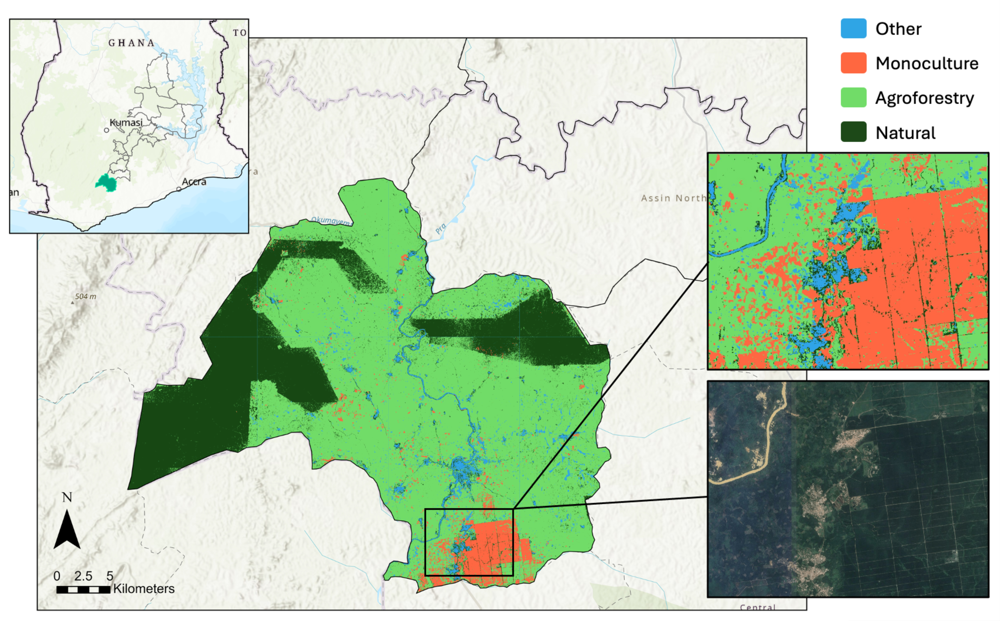

# Transfer Learning for Tree Classification in Ghana

**Problem Statement**: Differentiating between natural and agricultural trees using remote sensing is essential for assessing ecosystem services, commodity-driven deforestation, and restoration progress. In Ghana, distinguishing between these tree systems remains uniquely challenging because of multiple factors. These factors include high spectral similarity between certain systems; the small minimum mapping unit required to capture heterogenous, smallholder agricultural landscapes; and challenges such as persistent cloud cover and haze.

**Summary**: We use a transfer learning approach to classify tree-based systems, leveraging extracted spatial embeddings from a high-performing neural network to improve classification accuracy in label-scarce environments. We applied a CatBoost classifier to a combination of Sentinel imagery, gray-level co-occurrence matrix texture features, and extracted spatial embeddings to classify four land use classes: natural, agroforestry, monoculture, and other (background). Through comparative modeling and feature selection exercises, we validate performance gains resulting from transfer learning and texture features. Building on [Brandt et al's](https://github.com/wri/sentinel-tree-cover) (2023) previous efforts to model tree cover across the tropics, we explore whether the spatial features extracted from convolutional neural network can be repurposed to classify land uses.

Through a collaboration with Ghana's Environmnetal Protection Agency, the method is demonstrated for 26 priority districts, resulting in a 10-meter resolution land use map for 2020. Our findings suggest the spatial embeddings extracted from the tree cover model offer value beyond their original task and represent a scalable path forward for broader monitoring efforts.

Download the paper: [WRI Technical Note](https://www.wri.org/research/transfer-learning-detect-natural-monoculture-and-agroforestry-tree-based-systems-ghana)
View the data: [Ghana EPA Restoration Monitoring Portal](https://environmental-protection-agency-epa-ghana.hub.arcgis.com/pages/generalmap) (_toggle on WRI Land Use_)
Suggested citation: Ertel, J., J. Brandt, R. Rognstad, and E. Glen 2025. “Transfer learning to detect natural, monoculture, and agroforestry tree-based systems in Ghana using remote sensing.” Technical Note. Washington, DC: World Resources Institute. Available online at doi.org/10.46830/writn.24.00030.




## Repository Organization
```
├── LICENSE
├── README.md                      
├── contributing.md                  
├── requirements.txt               
├── Dockerfile                      
├── environment.yaml                 
├── params.yaml                      
├── config.yaml                      
├── dvc.yaml 
├── dvc.lock                        
├── src                                 <- Source code for use in this project.
│   ├── __init__.py                        
│   ├── stage_load_data.py          
│   ├── stage_prep_features.py      
│   ├── stage_select_and_tune.py    
│   ├── stage_train_model.py        
│   ├── stage_evaluate_model.py     
│   ├── transfer_learning.py        
│   │
│   ├── transfer                        <- Scripts/steps to perform feature extraction
│   │
│   ├── load_data                       <- Scripts to download or generate data
│   │   ├── __init__.py            
│   │   └── s3_download.py           
│   │
│   ├── features                        <- Scripts to import and prepare modeling inputs
│   │   ├── __init__.py             
│   │   ├── PlantationsData.py      
│   │   ├── create_xy.py            
│   │   ├── feature_selection.py    
│   │   ├── texture_analysis.py    
│   │   ├── slow_glcm.py            
│   │   └── fast_glcm.py            
│   │    
│   ├── model                           <- Scripts to train models, select features, tune
│   │   ├── __init__.py             
│   │   ├── train.py                   
│   │   └── tune.py               
│   │    
│   ├── evaluation                      <- Graphics and figures from model evaluation
│   │   ├── confusion_matrix_data.csv       
│   │   ├── confusion_matrix.png            
│   │   └── validation_visuals.py           
│   │
│   └── utils                           <- Scripts for utility functions
│       ├── __init__.py             
│       ├── cloud_removal.py         
│       ├── interpolation.py          
│       ├── proximal_steps.py        
│       ├── indices.py                
│       ├── logs.py                   
│       ├── preprocessing.py         
│       ├── validate_io.py          
│       ├── quick_viz.py             
│       └── mosaic.py               
│
├── notebooks                           <- Jupyter notebooks                         
│   ├── analyses         
│   ├── features     
│   ├── modeling      
│   └── training_data
│
├── .gitignore                     
├── .dockerignore                  
└── .dvcignore                   
```
## License
This project is licensed under the MIT License - see the [LICENSE.md](LICENSE) file for details.