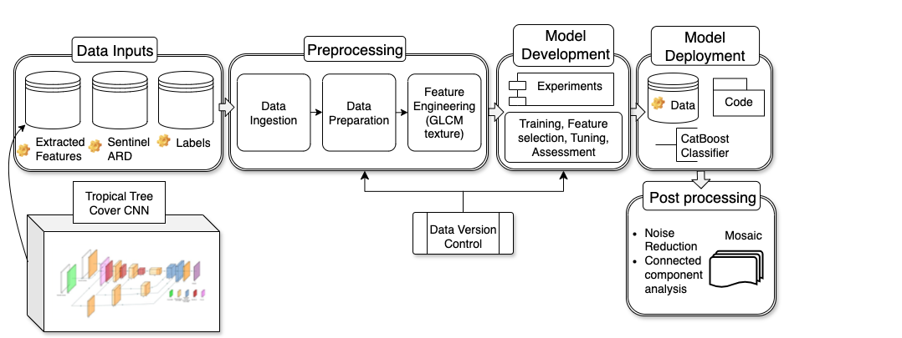

# Transfer Learning for Land Use Classification in Ghana

**Problem Statement**: Traditional classification methods struggle to distinguish natural and planted tree systems in cloud-prone, label scarce, heterogeneous landscapes like Ghana. We hypothesize that a transfer learning approach – leveraging [extracted tree features from a high performing neural network](https://github.com/wri/sentinel-tree-cover) – can significantly improve classification accuracy. To test this hypothesis, we apply a gradient boosting classification algorithm (CatBoost) to a combination of Sentinel-2 images, gray-level co-occurrence matrix (GLCM) texture features and extracted tree features. We assess whether the extracted features and GLCM texture features accelerate model learning and perform benchmarking against a standard deep learning technique. Through a feature selection exercise, we identify and validate the added value of the transferred features.

Through a collaboration with Ghana's Environmnetal Protection Agency, the application of the method is illustrated for 26 priority administrative districts. The final product is a 10m resolution land use map of Ghana for the year 2020 that distinguishes between natural, monoculture and agroforestry systems.  


## ML Pipeline Overview


## Repository Organization
```
├── LICENSE
├── README.md                      
├── contributing.md                  
├── requirements.txt               
├── Dockerfile                      
├── environment.yaml                 
├── params.yaml                      
├── config.yaml                      
├── dvc.yaml 
├── dvc.lock                        
├── src                                 <- Source code for use in this project.
│   ├── __init__.py                        
│   ├── stage_load_data.py          
│   ├── stage_prep_features.py      
│   ├── stage_select_and_tune.py    
│   ├── stage_train_model.py        
│   ├── stage_evaluate_model.py     
│   ├── transfer_learning.py        
│   │
│   ├── transfer                        <- Scripts/steps to perform feature extraction
│   │
│   ├── load_data                       <- Scripts to download or generate data
│   │   ├── __init__.py            
│   │   └── s3_download.py           
│   │
│   ├── features                        <- Scripts to import and prepare modeling inputs
│   │   ├── __init__.py             
│   │   ├── PlantationsData.py      
│   │   ├── create_xy.py            
│   │   ├── feature_selection.py    
│   │   ├── texture_analysis.py    
│   │   ├── slow_glcm.py            
│   │   └── fast_glcm.py            
│   │    
│   ├── model                           <- Scripts to train models, select features, tune
│   │   ├── __init__.py             
│   │   ├── train.py                   
│   │   └── tune.py               
│   │    
│   ├── evaluation                      <- Graphics and figures from model evaluation
│   │   ├── confusion_matrix_data.csv       
│   │   ├── confusion_matrix.png            
│   │   └── validation_visuals.py           
│   │
│   └── utils                           <- Scripts for utility functions
│       ├── __init__.py             
│       ├── cloud_removal.py         
│       ├── interpolation.py          
│       ├── proximal_steps.py        
│       ├── indices.py                
│       ├── logs.py                   
│       ├── preprocessing.py         
│       ├── validate_io.py          
│       ├── quick_viz.py             
│       └── mosaic.py               
│
├── notebooks                           <- Jupyter notebooks                         
│   ├── analyses         
│   ├── features     
│   ├── modeling      
│   └── training_data
│
├── .gitignore                     
├── .dockerignore                  
└── .dvcignore                   
```
## License
This project is licensed under the MIT License - see the [LICENSE.md](LICENSE) file for details.

## Citation
Ertel, J., Brandt, J., Glen, E., & Rognstad, R. Transfer Learning for Detecting Natural, Monoculture, and Agroforestry Systems in Ghana. Technical Note. Washington, DC: World Resources Institute. _(Expected August 2025)_